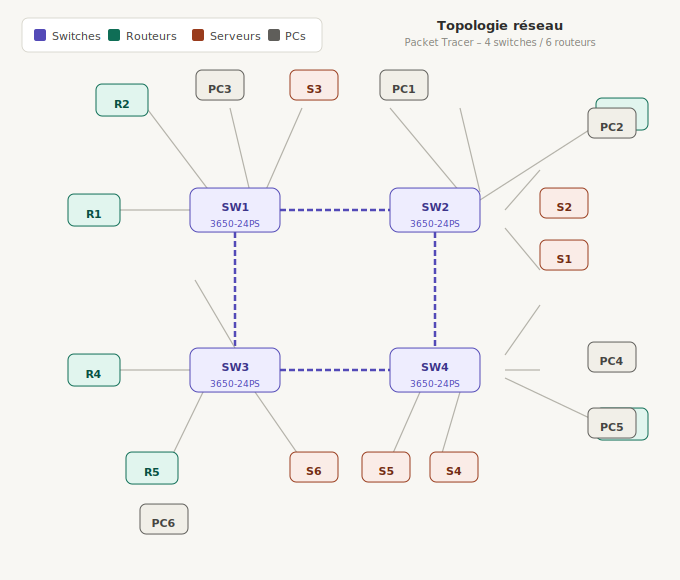

# 🌐 Infrastructure Réseau IPv6 — Cisco Packet Tracer

Projet réseau réalisé en solo sous **Cisco Packet Tracer**, mettant en œuvre une infrastructure d'entreprise multi-sites avec routage dynamique IPv6, segmentation VLAN, commutation redondante et services applicatifs.

## Présentation

Ce projet simule un réseau d'entreprise entièrement opérationnel réunissant **6 routeurs**, **4 switches multicouches**, **6 PCs** et **6 serveurs**, tous communicant exclusivement en **IPv6** (aucun routage IPv4). Le réseau est segmenté en plusieurs VLANs, route dynamiquement via **OSPFv3**, et assure la redondance de commutation via le protocole **PVST+ Spanning Tree** avec élection contrôlée du Root Bridge et blocage de ports maîtrisé.



---

## Topologie

La topologie physique repose sur un **anneau carré** : 4 switches multicouches interconnectés par des doubles liens redondants, formant le cœur du réseau de commutation. Chaque routeur se connecte à ce cœur via des sous-interfaces trunk (Router-on-a-Stick), et chaque switch dessert un groupe d'équipements terminaux.

```
        R1      R2      R3
         \      |      /
          \     |     /
        [Switch1]---[Switch2]
              |   X   |
        [Switch3]---[Switch4]
          /     |     \
         /      |      \
        R4      R5      R6
```

- **6 Routeurs** (Cisco 2811) : R1 à R6, chacun avec plusieurs sous-interfaces trunk dot1Q
- **4 Switches multicouches** (Cisco 3560-24PS) : Switch1 à Switch4
- **6 PCs** : PC1 à PC6, un par segment routeur
- **6 Serveurs** : S1 à S6, un par segment routeur

> 📸 *[Insérer ici le schéma détaillé de la topologie Packet Tracer]*

---

## Technologies et protocoles

| Couche | Technologie |
|---|---|
| Couche 3 — Routage | OSPFv3 (IPv6), Area 0 |
| Couche 3 — Adressage | IPv6 statique (PCs & Serveurs), sous-interfaces IPv6 (Routeurs) |
| Couche 2 — Commutation | Trunk VLAN 802.1Q |
| Couche 2 — Redondance | PVST+ Spanning Tree Protocol |
| Couche 2 — Encapsulation | dot1Q sur sous-interfaces (Router-on-a-Stick) |
| Couche Application | SMTP/POP3, FTP, HTTP/HTTPS, DNS |

---

## Plan d'adressage VLAN

Le réseau utilise **11 VLANs** au total :

| ID VLAN | Nom | Rôle |
|---|---|---|
| VLAN 1 | LAN_VLAN1 | Segment local R1 (PC1, S1) |
| VLAN 2 | LAN_VLAN2 | Segment local R2 (PC2, S2) |
| VLAN 3 | LAN_VLAN3 | Segment local R3 (PC3, S3) |
| VLAN 4 | LAN_VLAN4 | Segment local R4 (PC4, S4) |
| VLAN 5 | LAN_VLAN5 | Segment local R5 (PC5, S5) |
| VLAN 6 | LAN_VLAN6 | Segment local R6 (PC6, S6) |
| VLAN 12 | LIEN_R1_R2 | Lien inter-routeurs R1 ↔ R2 |
| VLAN 23 | LIEN_R2_R3 | Lien inter-routeurs R2 ↔ R3 |
| VLAN 34 | LIEN_R3_R4 | Lien inter-routeurs R3 ↔ R4 |
| VLAN 45 | LIEN_R4_R5 | Lien inter-routeurs R4 ↔ R5 |
| VLAN 56 | LIEN_R5_R6 | Lien inter-routeurs R5 ↔ R6 |

Chaque routeur se connecte au réseau de commutation via **un seul port trunk (FastEthernet0/0)** avec plusieurs sous-interfaces dot1Q — une pour son VLAN LAN local, une ou deux pour les VLANs de liens inter-routeurs.

```
Switch#show vlan brief 

VLAN Name                             Status    Ports
---- -------------------------------- --------- -------------------------------
1    default                          active    Gig1/0/4, Gig1/0/5, Gig1/0/6, Gig1/0/11
                                                Gig1/0/12, Gig1/0/13, Gig1/0/14, Gig1/0/15
                                                Gig1/0/16, Gig1/0/17, Gig1/0/18, Gig1/0/19
                                                Gig1/0/20, Gig1/0/21, Gig1/0/22, Gig1/1/1
                                                Gig1/1/2, Gig1/1/3, Gig1/1/4
2    LAN_VLAN2                        active    
3    LAN_VLAN3                        active    
4    LAN_VLAN4                        active    Gig1/0/7, Gig1/0/9
5    LAN_VLAN5                        active    Gig1/0/8, Gig1/0/10
6    LAN_VLAN6                        active    
12   Link_R1_R2                       active    
23   Link_R2_R3                       active    
34   Link_R3_R4                       active    
45   Link_R4_R5                       active    
56   Link_R5_R6                       active    
1002 fddi-default                     active    
1003 token-ring-default               active    
1004 fddinet-default                  active    
1005 trnet-default                    active
```

---

## Routage — OSPFv3

Les 6 routeurs exécutent **OSPFv3 en Area 0**, annonçant leurs préfixes LAN locaux et leurs préfixes de liens inter-routeurs. Chaque routeur est configuré avec :

- Un **Router ID** unique au format IPv4 (ex : `1.1.1.1` pour R1)
- **OSPFv3 activé par sous-interface** (`ipv6 ospf 1 area 0`)
- **Aucune adresse IPv4** — environnement 100% IPv6

Exemple de convention d'adressage sur les sous-interfaces (R2) :
```
interface FastEthernet0/0.2   → VLAN 2  → 2000:2001:112::2/64  (LAN local)
interface FastEthernet0/0.12  → VLAN 12 → 2000:12XX:112::2/64  (lien R1-R2)
interface FastEthernet0/0.23  → VLAN 23 → 2000:23XX:112::2/64  (lien R2-R3)
```

Ping du PC1 au PC6

```
C:\>ping 2000:6001:112::100

Pinging 2000:6001:112::100 with 32 bytes of data:

Reply from 2000:6001:112::100: bytes=32 time=10ms TTL=122
Reply from 2000:6001:112::100: bytes=32 time=33ms TTL=122
Reply from 2000:6001:112::100: bytes=32 time<1ms TTL=122
Reply from 2000:6001:112::100: bytes=32 time=1ms TTL=122

Ping statistics for 2000:6001:112::100:
    Packets: Sent = 4, Received = 4, Lost = 0 (0% loss),
Approximate round trip times in milli-seconds:
    Minimum = 0ms, Maximum = 33ms, Average = 11ms
```

TracerT du PC1 au PC6

```
C:\>tracert 2000:6001:112::100

Tracing route to 2000:6001:112::100 over a maximum of 30 hops: 

  1   0 ms      0 ms      0 ms      2000:1001:112::1
  2   0 ms      0 ms      0 ms      2000:102:112::2
  3   1 ms      0 ms      0 ms      2000:203:112::3
  4   0 ms      10 ms     10 ms     2000:304:112::4
  5   10 ms     10 ms     6 ms      2000:405:112::5
  6   0 ms      0 ms      10 ms     2000:506:112::6
  7   10 ms     10 ms     10 ms     2000:6001:112::100

Trace complete.
```
---

## Commutation — Spanning Tree

Les 4 switches sont interconnectés en **anneau carré** avec **double lien par segment** (8 câbles inter-switch au total), créant plusieurs boucles redondantes. PVST+ gère la prévention des boucles par VLAN.

### Configuration STP

| Switch | Priorité STP | Rôle |
|---|---|---|
| Switch4 | 4096 | ✅ Root Bridge (tous VLANs) |
| Switch1 | 28672 | Non-root |
| Switch2 | 61440 | Non-root (3 ports bloqués) |
| Switch3 | 32768 (défaut) | Non-root |

- **Root Bridge** : Switch4 (`spanning-tree vlan 1-4094 priority 4096`)
- **Switch avec 3 ports bloqués** : Switch2 — ports en état `Altn BLK`
- Tous les ports bloqués sont des ports **GigabitEthernet**
- Configuration réalisée **sans utiliser la commande `spanning-tree cost`**

Spanning-Tree du swithc 4 ( le switch root)

```
Switch#show spanning-tree
VLAN0001
  Spanning tree enabled protocol ieee
  Root ID    Priority    4097
             Address     00E0.F75D.4363
             This bridge is the root
             Hello Time  2 sec  Max Age 20 sec  Forward Delay 15 sec

  Bridge ID  Priority    4097  (priority 4096 sys-id-ext 1)
             Address     00E0.F75D.4363
             Hello Time  2 sec  Max Age 20 sec  Forward Delay 15 sec
             Aging Time  20

Interface        Role Sts Cost      Prio.Nbr Type
---------------- ---- --- --------- -------- --------------------------------
Gi1/0/1          Desg FWD 4         128.1    P2p
Gi1/0/2          Desg FWD 4         128.2    P2p
Gi1/0/3          Desg FWD 19        128.3    P2p
Gi1/0/23         Desg FWD 4         128.23   P2p
Gi1/0/24         Desg FWD 4         128.24   P2p

VLAN0002
  Spanning tree enabled protocol ieee
  Root ID    Priority    4098
             Address     00E0.F75D.4363
             This bridge is the root
             Hello Time  2 sec  Max Age 20 sec  Forward Delay 15 sec

  Bridge ID  Priority    4098  (priority 4096 sys-id-ext 2)
             Address     00E0.F75D.4363
             Hello Time  2 sec  Max Age 20 sec  Forward Delay 15 sec
             Aging Time  20

Interface        Role Sts Cost      Prio.Nbr Type
---------------- ---- --- --------- -------- --------------------------------
Gi1/0/1          Desg FWD 4         128.1    P2p
Gi1/0/2          Desg FWD 4         128.2    P2p
Gi1/0/3          Desg FWD 19        128.3    P2p
Gi1/0/23         Desg FWD 4         128.23   P2p
Gi1/0/24         Desg FWD 4         128.24   P2p

VLAN0003
  Spanning tree enabled protocol ieee
  Root ID    Priority    4099
             Address     00E0.F75D.4363
             This bridge is the root
             Hello Time  2 sec  Max Age 20 sec  Forward Delay 15 sec
             
  Bridge ID  Priority    4099  (priority 4096 sys-id-ext 3)
             Address     00E0.F75D.4363
             Hello Time  2 sec  Max Age 20 sec  Forward Delay 15 sec
             Aging Time  20

Interface        Role Sts Cost      Prio.Nbr Type
---------------- ---- --- --------- -------- --------------------------------
Gi1/0/1          Desg FWD 4         128.1    P2p
Gi1/0/2          Desg FWD 4         128.2    P2p
Gi1/0/3          Desg FWD 19        128.3    P2p
Gi1/0/23         Desg FWD 4         128.23   P2p
Gi1/0/24         Desg FWD 4         128.24   P2p

VLAN0004
  Spanning tree enabled protocol ieee
  Root ID    Priority    4100
             Address     00E0.F75D.4363
             This bridge is the root
             Hello Time  2 sec  Max Age 20 sec  Forward Delay 15 sec

  Bridge ID  Priority    4100  (priority 4096 sys-id-ext 4)
             Address     00E0.F75D.4363
             Hello Time  2 sec  Max Age 20 sec  Forward Delay 15 sec
             Aging Time  20

Interface        Role Sts Cost      Prio.Nbr Type
---------------- ---- --- --------- -------- --------------------------------
Gi1/0/1          Desg FWD 4         128.1    P2p
Gi1/0/2          Desg FWD 4         128.2    P2p
Gi1/0/3          Desg FWD 19        128.3    P2p
Gi1/0/7          Desg FWD 19        128.7    P2p
Gi1/0/9          Desg FWD 19        128.9    P2p
Gi1/0/23         Desg FWD 4         128.23   P2p
Gi1/0/24         Desg FWD 4         128.24   P2p

VLAN0005
  Spanning tree enabled protocol ieee
  Root ID    Priority    4101
             Address     00E0.F75D.4363
             This bridge is the root
             Hello Time  2 sec  Max Age 20 sec  Forward Delay 15 sec

  Bridge ID  Priority    4101  (priority 4096 sys-id-ext 5)
             Address     00E0.F75D.4363
             Hello Time  2 sec  Max Age 20 sec  Forward Delay 15 sec
             Aging Time  20

Interface        Role Sts Cost      Prio.Nbr Type
---------------- ---- --- --------- -------- --------------------------------
Gi1/0/1          Desg FWD 4         128.1    P2p
Gi1/0/2          Desg FWD 4         128.2    P2p
Gi1/0/3          Desg FWD 19        128.3    P2p
Gi1/0/8          Desg FWD 19        128.8    P2p
Gi1/0/10         Desg FWD 19        128.10   P2p
Gi1/0/23         Desg FWD 4         128.23   P2p
Gi1/0/24         Desg FWD 4         128.24   P2p

VLAN0006
  Spanning tree enabled protocol ieee
  Root ID    Priority    4102
             Address     00E0.F75D.4363
             This bridge is the root
             Hello Time  2 sec  Max Age 20 sec  Forward Delay 15 sec

  Bridge ID  Priority    4102  (priority 4096 sys-id-ext 6)
             Address     00E0.F75D.4363
             Hello Time  2 sec  Max Age 20 sec  Forward Delay 15 sec
             Aging Time  20

Interface        Role Sts Cost      Prio.Nbr Type
---------------- ---- --- --------- -------- --------------------------------
Gi1/0/1          Desg FWD 4         128.1    P2p
Gi1/0/2          Desg FWD 4         128.2    P2p
Gi1/0/3          Desg FWD 19        128.3    P2p
Gi1/0/23         Desg FWD 4         128.23   P2p
Gi1/0/24         Desg FWD 4         128.24   P2p

VLAN0012
  Spanning tree enabled protocol ieee
  Root ID    Priority    4108
             Address     00E0.F75D.4363
             This bridge is the root
             Hello Time  2 sec  Max Age 20 sec  Forward Delay 15 sec

  Bridge ID  Priority    4108  (priority 4096 sys-id-ext 12)
             Address     00E0.F75D.4363
             Hello Time  2 sec  Max Age 20 sec  Forward Delay 15 sec
             Aging Time  20

Interface        Role Sts Cost      Prio.Nbr Type
---------------- ---- --- --------- -------- --------------------------------
Gi1/0/1          Desg FWD 4         128.1    P2p
Gi1/0/2          Desg FWD 4         128.2    P2p
Gi1/0/3          Desg FWD 19        128.3    P2p
Gi1/0/23         Desg FWD 4         128.23   P2p
Gi1/0/24         Desg FWD 4         128.24   P2p

VLAN0023
  Spanning tree enabled protocol ieee
  Root ID    Priority    4119
             Address     00E0.F75D.4363
             This bridge is the root
             Hello Time  2 sec  Max Age 20 sec  Forward Delay 15 sec

  Bridge ID  Priority    4119  (priority 4096 sys-id-ext 23)
             Address     00E0.F75D.4363
             Hello Time  2 sec  Max Age 20 sec  Forward Delay 15 sec
             Aging Time  20

Interface        Role Sts Cost      Prio.Nbr Type
---------------- ---- --- --------- -------- --------------------------------
Gi1/0/1          Desg FWD 4         128.1    P2p
Gi1/0/2          Desg FWD 4         128.2    P2p
Gi1/0/3          Desg FWD 19        128.3    P2p
Gi1/0/23         Desg FWD 4         128.23   P2p
Gi1/0/24         Desg FWD 4         128.24   P2p

VLAN0034
  Spanning tree enabled protocol ieee
  Root ID    Priority    4130
             Address     00E0.F75D.4363
             This bridge is the root
             Hello Time  2 sec  Max Age 20 sec  Forward Delay 15 sec

  Bridge ID  Priority    4130  (priority 4096 sys-id-ext 34)
             Address     00E0.F75D.4363
             Hello Time  2 sec  Max Age 20 sec  Forward Delay 15 sec
             Aging Time  20

Interface        Role Sts Cost      Prio.Nbr Type
---------------- ---- --- --------- -------- --------------------------------
Gi1/0/1          Desg FWD 4         128.1    P2p
Gi1/0/2          Desg FWD 4         128.2    P2p
Gi1/0/3          Desg FWD 19        128.3    P2p
Gi1/0/23         Desg FWD 4         128.23   P2p
Gi1/0/24         Desg FWD 4         128.24   P2p

VLAN0045
  Spanning tree enabled protocol ieee
  Root ID    Priority    4141
             Address     00E0.F75D.4363
             This bridge is the root
             Hello Time  2 sec  Max Age 20 sec  Forward Delay 15 sec

  Bridge ID  Priority    4141  (priority 4096 sys-id-ext 45)
             Address     00E0.F75D.4363
             Hello Time  2 sec  Max Age 20 sec  Forward Delay 15 sec
             Aging Time  20

Interface        Role Sts Cost      Prio.Nbr Type
---------------- ---- --- --------- -------- --------------------------------
Gi1/0/1          Desg FWD 4         128.1    P2p
Gi1/0/2          Desg FWD 4         128.2    P2p
Gi1/0/3          Desg FWD 19        128.3    P2p
Gi1/0/23         Desg FWD 4         128.23   P2p
Gi1/0/24         Desg FWD 4         128.24   P2p

VLAN0056
  Spanning tree enabled protocol ieee
  Root ID    Priority    4152
             Address     00E0.F75D.4363
             This bridge is the root
             Hello Time  2 sec  Max Age 20 sec  Forward Delay 15 sec

  Bridge ID  Priority    4152  (priority 4096 sys-id-ext 56)
             Address     00E0.F75D.4363
             Hello Time  2 sec  Max Age 20 sec  Forward Delay 15 sec
             Aging Time  20

Interface        Role Sts Cost      Prio.Nbr Type
---------------- ---- --- --------- -------- --------------------------------
Gi1/0/1          Desg FWD 4         128.1    P2p
Gi1/0/2          Desg FWD 4         128.2    P2p
Gi1/0/3          Desg FWD 19        128.3    P2p
Gi1/0/23         Desg FWD 4         128.23   P2p
Gi1/0/24         Desg FWD 4         128.24   P2p
```

Celui du switch 2 sur le vlan1

```
Switch#show spanning-tree vlan 1
VLAN0001
  Spanning tree enabled protocol ieee
  Root ID    Priority    4097
             Address     00E0.F75D.4363
             Cost        8
             Port        1(GigabitEthernet1/0/1)
             Hello Time  2 sec  Max Age 20 sec  Forward Delay 15 sec

  Bridge ID  Priority    61441  (priority 61440 sys-id-ext 1)
             Address     00E0.8FEC.423A
             Hello Time  2 sec  Max Age 20 sec  Forward Delay 15 sec
             Aging Time  20

Interface        Role Sts Cost      Prio.Nbr Type
---------------- ---- --- --------- -------- --------------------------------
Gi1/0/1          Root FWD 4         128.1    P2p
Gi1/0/2          Altn BLK 4         128.2    P2p
Gi1/0/3          Desg FWD 19        128.3    P2p
Gi1/0/7          Desg FWD 19        128.7    P2p
Gi1/0/23         Altn BLK 4         128.23   P2p
Gi1/0/24         Altn BLK 4         128.24   P2p
```

---

## Services applicatifs

| Serveur | Service | Détails |
|---|---|---|
| S1 | DNS | Résolution de noms pour le réseau |
| S4 | SMTP / POP3 | Serveur mail — domaine `matteogalus.com` |
| S5 | FTP | Serveur de transfert de fichiers |
| S6 | HTTP / HTTPS | Serveur web |

### Test messagerie
Deux comptes utilisateurs sont configurés sur le serveur SMTP (S4) :
- **User1** / `pass1` → configuré sur le client mail d'un PC (Desktop → E Mail)
- **User2** / `pass2` → configuré sur un second PC client

> 📸 *[Insérer ici une capture d'un envoi/réception de mail réussi entre User1 et User2]*

> 📸 *[Insérer ici une capture d'un accès HTTP réussi depuis un PC vers le serveur web S6]*
